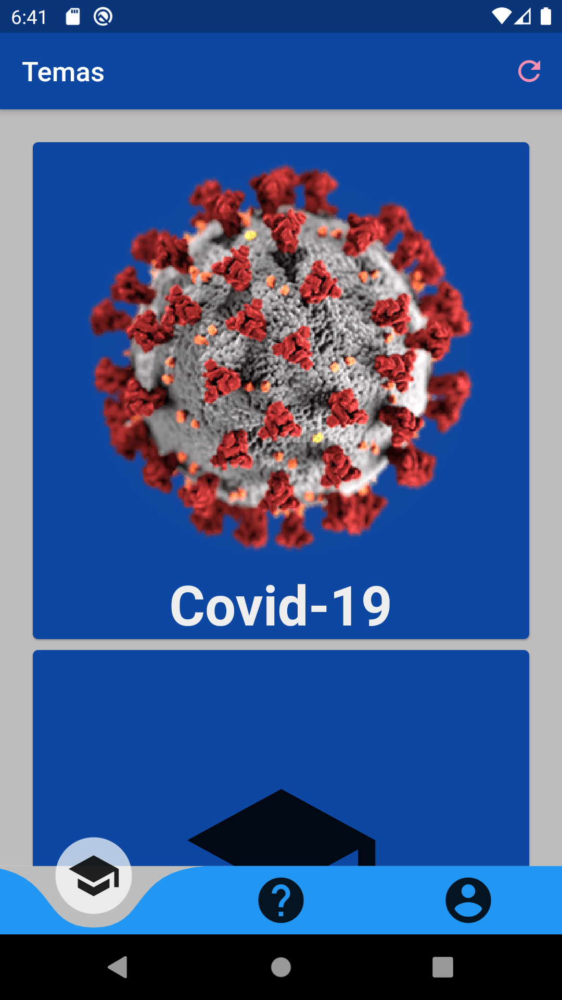

# covid_buster_lite
Flutter Application to make quizzes based on different health related topics, especially on Covid-19




Cada Test contiene una serie de preguntas y está agrupado en Temas de interés. 
 
 Un Tema tiene como propiedades:
* id: Identificador unívoco, NO debe repetirse en ningún caso.
* title: el título que aparecerá en su tarjeta
* description: aparecerá en el detalle una vez seleccionado el tema concreto
* img: imagen que lo identifique, esta imagen:
  - Si va precedida de "icon:" podrá ser cualquier icono de la [biblioteca de flutter](https://api.flutter.dev/flutter/material/Icons-class.html):
      - "icon:0xe8b5"
  - Si va precedida de "http" se buscará la URL correspondiente (recuerde que debe permitir hotlink):
      - "https://github.com/adam-p/markdown-here/raw/master/src/common/images/icon48.png"
* version: version del tema
* date: fecha de la ultima version
* changelog: cambios de la ultima version
* quizzes: Colección de tests relacionados con ese tema

 Un Test contiene las siguientes propiedades:
* id: Identificador unívoco, NO debe repetirse en ningún caso.
* title: Título que aparecerá en la lista de tests dentro de un tema
* description: Descripcion que se mostrará en el detalle del test una vez seleccionado
* topic: Tema al que pertenece para mostrarlo en el detalle,
* retry: Número de reintentos por pregunta, si es 0 no hay límite.
* version: Versión del test,
* results: Qué significa la puntuación obtenida, y se define mediante una fórmula y el texto a mostrar en caso de que se dé la condición;
    por ejemplo:
    ```json
    [{
        "formula": "x > 5 && x < 10",
        "result":"Adelante con el cambio de fase"
    },
    {
         "formula":"x < 5",
         "result": " Una semana de demora"
    }]
    ```
* questions: Lista de preguntas:
    * id: identifica univocamente, NO debe repetirse en ningun caso.
    * question: Pregunta
    * topic: Se puede usar para crear subtemas y así saber el contexto de la pregunta
    * video: Video de la pregunta (TBD)
    * answers: Respuestas posibles:
        * id: Identificador unívoco, NO debe repetirse en ningún caso.
        * value: Texto de la respuesta
        * detail: Detalle de la respuesta, en caso de que la elija se mostrará este texto.
        * correct: true o false según sea o no la respuesta correcta
        * type:
            * "number" mostrará un slider con un minimo y un máximo y una fórmula que afecte al resultado seleccionado, por ejemplo:
             ```json
               {
                "min": 0,
                "max": 10,
                "formula": "x*-1"
                }
             ```
         